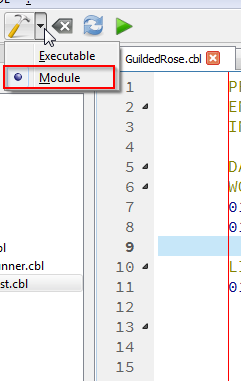
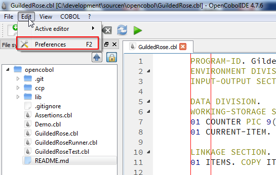
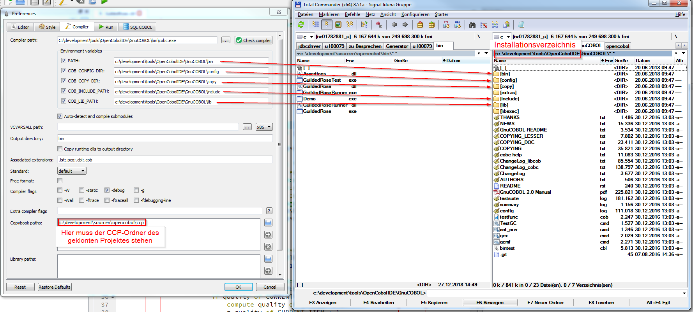
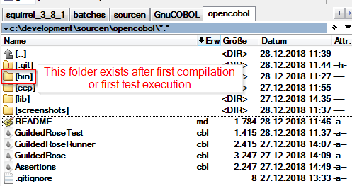

# What you find in this project
The project is based on Guided Rose Kata from [Github](https://github.com/emilybache/GildedRose-Refactoring-Kata/tree/master/COBOL/mf)

The original source has modified, to enable the execution as a sub-module from a Main-Program.

It is located in GuildedRose.cbl. This file will can be compiled as a module and can be found in bin/ folder as dll and exe after compilation. 

Normally OpenCobolIDE will do this work, when it detect changes and the test classes are executed.

# How to use this project
The code was written with OpenCobolIDE. Download installer from [here](https://launchpad.net/cobcide/+download)

*Tested with Windows and Fedora28. In Fedora and possibly all UNIX-systems the installation 
does not work, so please use Windows*

Just follow installation instruction, it will be installed as any Windows application, like Word or Excel.

After installation any of the COBOL-Sources can be opened.
Dependent from installation directory some changes in settings could be
neccessary (when default install directory was changed). 

See Edit => Preferences => Compiler.
The first five paths should fit to the installation directory of the
OpenCobolIDE.
Additionally the folder ccp has to be added to "Copybook paths" on same page.

The compiled modules are in a bin folder, in root of cloned directory.

# Start the application
First change to develop-branch!

To check what the production code does the GuildedRoseRunner.cbl program can be used; it just needs to be executed.

Module tests are located in GuildedRoseTest.cbl. This program can also be executed, it should finish with Return-Code 8 and a failing assertion.
